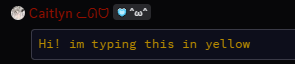
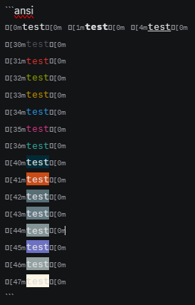

> ## Whispers
> A Vencord plugin to automatically send subtext messages
>
> -# I lied, it can add any prefix and suffix for your messages :3

This can be use for simple things like automatically adding "-# " to your messages so they show as subtext:

```bash
prefix > "-# "
suffix > ""
```


Or for really complex and annoying things to type, like ansi codes. Discord has some ansi code support, so say you wanted to talk using the color yellow, you can do this by using this settings:

```bash
prefix > "```ansi\n"
suffix > "\n```"
```


> ℹ️ [ being U+001B](https://unicode-explorer.com/c/001B)

> ℹ️ These are the ansicodes that discord support (27/06/25):


